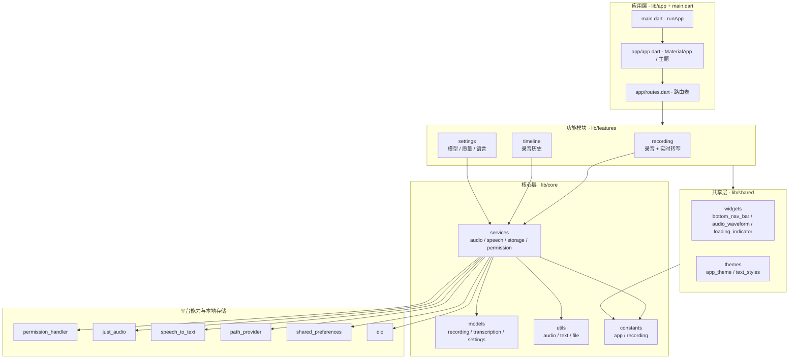
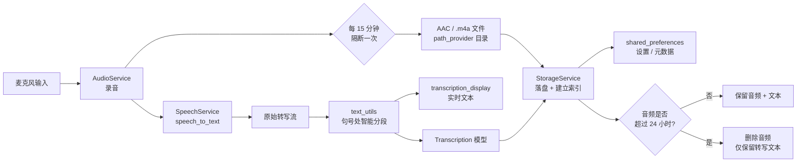
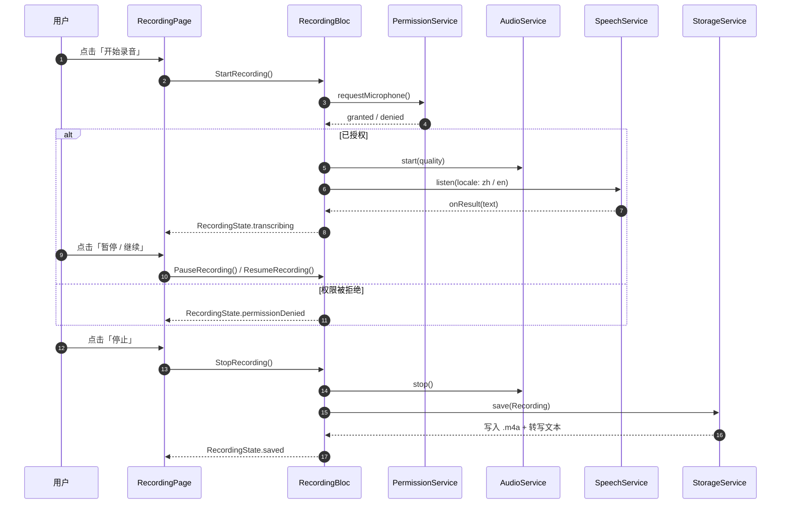
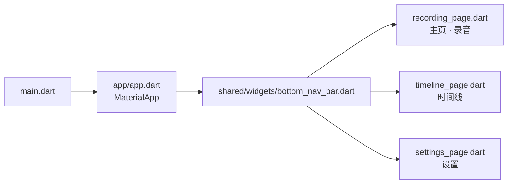
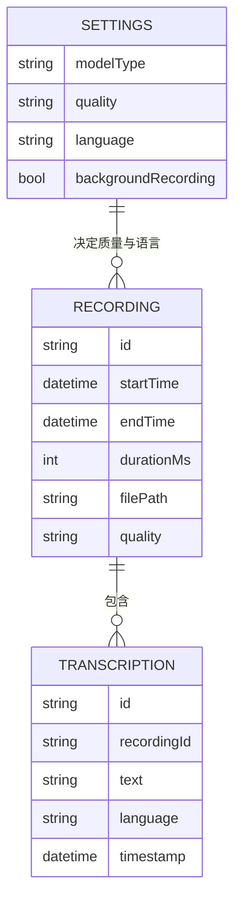

<div align="center">

> [English](./README_en.md) | **简体中文**


# assistantx — 全天候录音 · 实时转写 · ADHD 友好

**让每一段对话都不再被遗忘 —— 打开即录，边说边成文，时间线里可回看。**


</div>

---

## ⚠️ 项目状态（先读这里）

本仓库目前处于**「设计先行 · 脚手架」阶段**，请带着正确的预期阅读：

- ✅ **已落地**：`RaySpec/` 中的完整产品设计与分阶段开发规格；模块化目录结构（`create_project_structure.sh` 生成）；`pubspec.yaml` 依赖已配置并锁定（`pubspec.lock`）。
- 🚧 **尚未实现**：`lib/` 下除 `main.dart`（Flutter 默认计数器示例）外的**所有 `.dart` 文件当前为空占位文件**。录音、转写、时间线、设置等业务逻辑**均未编写**。
- 📐 本文档中的**架构图与流程图为 `RaySpec/Building/Project.md` 定义的目标架构**（target architecture），用于对齐后续开发，**不代表已实现的功能**。

> 这不是一个"能跑起来录音"的成品，而是一份**可被 AI Agent 直接接续执行**的工程骨架 + 设计约束。所有"A 如何工作"的描述都以「规划 / 设计」为准。

---

## 它解决什么问题

对 **ADHD（注意力缺陷多动障碍）人群**、**商务人群**与**学生群体**而言，真正的痛点不是"没有录音笔"，而是：

- 🧠 **转头就忘**：会议 / 课堂 / 谈判里的关键信息，散落在记忆与碎片笔记中，事后无法复原；
- 📱 **录音 ≠ 可检索**：录了几小时音频，却没有可读、可搜、可复制的文本，等于没录；
- 🔋 **开机负担**：通用录音软件操作步骤多、要记得点、要记得关，恰恰是注意力缺陷人群最容易漏掉的环节。

**assistantx 的目标是把它变成"零操作负担"**：打开即进入录音界面、边说边实时成文、结束后自动落进按时间串联的时间线，并对音频做「**只留 24 小时、文本永久保留**」的容量策略——忘性交给机器，你只管说话。

> **面向未来**：录音只是底座。`RaySpec` 已规划自动分段、实时翻译、就录音提问、自动记忆与待办/日程等 AI 能力（见下方「功能」中的规划项）。

---

## ✨ 功能

> 图例：✅ 已落地（结构 / 依赖 / 规格层面） · 🚧 规划中（设计已定义，代码待实现）

### 录音（recording）

- 🚧 **打开即录**：应用启动直接进入录音页，无需导航。
- 🚧 **暂停 / 继续**：浮动按钮快速切换录音状态。
- 🚧 **双档音质**：标准质量 `16 kHz / 64 kbps`，高音质 `44.1 kHz / 128 kbps`。
- 🚧 **长时录音**：每 **15 分钟自动隔断**一次文件，单次会话最长 **12 小时**。
- 🚧 **后台录音**：支持应用退到后台后继续录音（依赖后台运行权限）。

### 实时转写（transcription）

- 🚧 **实时转文字**：录音过程中同步显示转写文本，目标延迟 **< 3 秒**。
- 🚧 **中英双语**：主要支持中文与英文。
- 🚧 **智能分段**：在**句号处自动换行**，把连续语音流切成可读段落。
- 🚧 **本地模型 / 在线 API**：转写模型可选（在线识别服务如讯飞为后续规划）。

### 时间线（timeline）

- 🚧 **左侧时间线串联**：按时间顺序展示每条录音的开始时间、持续时间、结束时间。
- 🚧 **播放 / 删除 / 搜索**：回放录音、删除记录、在转写文本中搜索关键词。

### 存储与隐私

- 🚧 **AAC（`.m4a`）格式**落盘。
- 🚧 **24 小时容量策略**：音频累计保留约 24 小时，超期自动删除音频文件、**仅保留转写文本**。
- 🚧 **本地优先 + 加密**：数据存储加密、隐私优先（额外要求）。

### 工程骨架

- ✅ **模块化目录**：`core / features / shared / app / localization` 五层划分。
- ✅ **状态管理选型**：`flutter_bloc 9.1.1` + `bloc 9.1.0`。
- ✅ **多端工程**：Android / iOS / macOS / Windows / Linux / Web 六端脚手架均已生成。
- ✅ **规格文档体系**：`RaySpec/` 内含需求、架构约定、分阶段提示词、检查清单与变更历史。

---

## 🚀 快速开始

### 方式一：面向 AI Agent（一键安装，推荐）

把下面这段提示词直接发给你的本地 AI Agent（Claude Code / Codex / OpenCode …）：

````markdown
请帮我跑起 assistantx（GitHub: https://github.com/RayMorTwinkle/assistantx）。
背景：这是一个 Flutter/Dart 的「全天候录音 + 实时转写」应用，主要面向 ADHD 人群，
目前处于脚手架阶段——目录与依赖已就绪，但 lib/ 下的业务代码大多还是空文件。
请先阅读 RaySpec/Building/Project.md 了解目录约定与代码规范，再动手。

步骤：
1. 克隆并进入：git clone https://github.com/RayMorTwinkle/assistantx.git && cd assistantx
2. 确认本机 Flutter 版本 ≥ 3.35.0、Dart ≥ 3.9.2（flutter --version）。
3. 拉取依赖：flutter pub get
4. 静态检查：flutter analyze（应先通过，无致命错误）。
5. 运行默认入口：flutter run（当前会看到 Flutter 默认计数器示例界面）。
6. 汇报：已落地内容、与环境不符的地方，以及按 Project.md 下一步该实现的模块。
````

### 方式二：面向人类用户

```bash
git clone https://github.com/RayMorTwinkle/assistantx.git
cd assistantx
flutter pub get        # 解析 pubspec.lock 中的锁定版本
flutter analyze        # 静态检查
flutter run            # 运行（当前为默认示例界面）
```

> **环境要求**：Flutter `>=3.35.0`（stable 通道）、Dart SDK `^3.9.2`。
> 构建 Android 需 Android SDK；构建桌面端（macOS / Windows / Linux）需对应平台工具链。
> 若要编写代码，请先阅读 `RaySpec/Building/Project.md`——它是本项目的最高约定。

---

## 🖥️ 使用

### 目标工作流（规划）

```text
打开应用 ──▶ 录音页（主页）               时间线页                 设置页
────────      ──────────────              ────────                ────────
启动即进入     实时转写文本滚动显示         按时间串联历史录音        转写模型选择
「🎙️ 开始」    「⏸️ 暂停 / ▶️ 继续」       点击回放 / 删除 / 搜索    录音质量（标准/高音质）
              「⏹️ 停止」→ 自动存入时间线    24 小时容量管理          语言选择（中 / 英）
```

### 三个页面

| 页面 | 源文件 | 职责（规划） |
|---|---|---|
| 主页 · 录音 | `lib/features/recording/pages/recording_page.dart` | 打开即录；显示实时转写；开始/暂停/继续控制 |
| 时间线 | `lib/features/timeline/pages/timeline_page.dart` | 左侧时间线串联录音历史；播放 / 删除 / 搜索 |
| 设置 | `lib/features/settings/pages/settings_page.dart` | 转写模型、录音质量、语言等配置，持久化保存 |

---

## 🏗️ 架构

> 以下为 `RaySpec/Building/Project.md` 定义的**目标架构**（真实模块名与依赖关系来自该文档）。业务代码尚未实现。

### 系统总览

五层结构：应用层整合功能模块与共享组件；功能模块统一依赖核心层的服务、模型、工具与常量；服务层再对接各平台能力插件。



### 数据流：录音 → 转写 → 存储

音频进入后一分为二：一条经 `SpeechService` 变成实文本，一条落盘为 `.m4a`；文本在句号处分段后同时供 UI 实时显示与持久化；存储阶段按 24 小时策略裁剪音频。



### 关键流程：录音状态机（Bloc 时序）

`RecordingPage` 只负责展示与派发事件，`RecordingBloc` 编排权限、录音、转写与存储四类服务。



### 页面导航

底部导航栏作为应用层与三个功能页面之间的唯一切换入口。



### 数据模型

三张核心模型：`Recording`（一次录音）、`Transcription`（其转写文本）、`Settings`（决定质量与语言）。



> 字段名基于 `Project.md` 中「录音模型 / 转写文本模型 / 设置模型」的职责描述设计，**具体字段以最终实现的 `lib/core/models/*.dart` 为准**。

---

## 📂 目录结构

```text
assistantx/
├── lib/
│   ├── main.dart                     # 应用入口（当前为 Flutter 默认计数器示例）
│   ├── app/                          # 应用层：app.dart（配置/主题）、routes.dart（路由）
│   ├── core/                         # 核心层
│   │   ├── constants/                # app_constants.dart、recording_constants.dart
│   │   ├── utils/                    # audio_utils.dart、text_utils.dart、file_utils.dart
│   │   ├── services/                 # audio / speech / storage / permission 四服务
│   │   └── models/                   # recording / transcription / settings 模型
│   ├── features/                     # 功能模块
│   │   ├── recording/                # pages / widgets / bloc
│   │   ├── timeline/                 # pages / widgets / bloc
│   │   └── settings/                 # pages / widgets / bloc
│   ├── shared/                       # 共享层：widgets（含 audio_waveform）、themes
│   └── localization/                 # arb/app_en.arb、arb/app_zh.arb、localization.dart
├── RaySpec/                          # 项目规格文档体系（本仓库的"最高约定"）
│   ├── Create/Beginning.md           # 需求与设计问答（目标人群 / 页面 / 功能规格）
│   ├── Building/Project.md           # 目录结构 + 代码规范 + 耦合点 + 七天修改记录
│   ├── Building/Check.md             # 检查清单（flutter analyze / 更新 Project.md）
│   ├── ORtoken.md                    # 分四阶段、共 12 步的开发提示词
│   └── Fix/History.md                # 超期修改记录的归档
├── android/  ios/  macos/  windows/  linux/  web/   # 六端工程脚手架
├── assets/
│   ├── logo.svg                      # 本 README 使用的项目图标
│   └── icons/                        # 图标资源目录（pubspec.yaml 已声明）
├── create_project_structure.sh       # 一键生成 lib/ 目录结构（touch 占位文件）
├── pubspec.yaml                      # 依赖与资源声明
├── pubspec.lock                      # 锁定版本（Dart ^3.9.2 / Flutter >=3.35.0）
└── analysis_options.yaml             # flutter_lints 静态检查规则
```

---

## 🔧 技术细节

**核心依赖（版本取自 `pubspec.lock`，已锁定）**

| 包 | 版本 | 用途 |
|---|---|---|
| `flutter_bloc` / `bloc` | `9.1.1` / `9.1.0` | 状态管理与事件编排 |
| `speech_to_text` | `7.3.0` | 语音转文字（实时转写） |
| `just_audio` | `0.10.5` | 录音文件回放 |
| `permission_handler` | `12.0.1` | 麦克风 / 存储 / 后台 权限申请 |
| `path_provider` | `2.1.5` | 定位录音文件的本地存储目录 |
| `shared_preferences` | `2.5.3` | 设置与元数据持久化 |
| `dio` | `5.9.0` | HTTP 请求（在线转写 API 等） |
| `cupertino_icons` | `1.0.8` | iOS 风格图标 |

**环境与平台**

- Dart SDK 约束 `^3.9.2`；Flutter 引擎约束 `>=3.35.0`（`.metadata` 通道为 `stable`）。
- Android `applicationId` / `namespace` 为 `com.example.assistantx`（仍是默认值，未替换）。
- `lib/localization/` 预留国际化（`app_en.arb` / `app_zh.arb`），但 `pubspec.yaml` 尚未配置 `flutter_localizations` / `intl` 的生成入口（**待确认**）。

**产品规格中的硬数字（来自 `RaySpec/Create/Beginning.md`）**

| 项 | 值 |
|---|---|
| 标准质量 | 采样率 `16 kHz`，比特率 `64 kbps` |
| 高音质 | 采样率 `44.1 kHz`，比特率 `128 kbps` |
| 分段 / 时长上限 | 每 `15 分钟`隔断，单次最长 `12 小时` |
| 音频格式 | AAC（`.m4a`） |
| 音频容量策略 | 累计保留约 `24 小时`，超期删除音频、保留文本 |
| 转写语言 | 中文、英文 |
| 转写延迟目标 | `< 3 秒` |
| 响应式断点 | 单断点 `800 px`（移动端 / 桌面端） |

**代码规范（来自 `RaySpec/Building/Project.md`，动手前必读）**

- 命名：文件 `snake_case`、类 `PascalCase`、变量/函数 `camelCase`、常量 `UPPER_SNAKE_CASE`、私有 `_x`。
- 单文件理想 `≤ 300 行`（拆分阈值 `400`）；优先 `const` 构造函数；导入顺序 Dart → 第三方 → 项目模块。
- 每次修改后运行 `flutter analyze`；更新文件头注释并同步 `Project.md`。

**模块耦合点（改一处，需连带检查）**

1. 录音模块 ↔ 存储服务：改录音格式需同步检查文件处理逻辑。
2. 转写服务 ↔ 设置模块：改模型选择需验证转写服务兼容性。
3. 时间线模块 ↔ 录音模型：改数据结构需更新时间线展示逻辑。
4. 权限服务 ↔ 所有功能模块：权限逻辑变更影响所有依赖权限的功能。
5. 主题系统 ↔ 所有 UI 组件：主题变更需检查全部自定义组件适配。

---

## ❓ 常见问题

**Q：现在 Clone 下来能录音吗？**
A：不能。当前处于脚手架阶段，`lib/` 下业务代码为空占位，`flutter run` 看到的是 Flutter 默认计数器示例。请以 `RaySpec/Building/Project.md` + `RaySpec/ORtoken.md` 的分阶段提示词为起点继续开发。

**Q：为什么项目里有 `RaySpec/` 这么多文档？**
A：本项目采用"设计先行"。`Create/Beginning.md` 定需求，`Building/Project.md` 定目录与规范（最高约定），`ORtoken.md` 给出分 4 阶段 12 步的可执行提示词，`Check.md` 是检查清单。任何改动都要求与这些文档保持一致。

**Q：转写用的是本地模型还是在线 API？**
A：设计上两者都可选（设置页可切换）。在线识别服务（如讯飞）属后续规划；具体实现**待确认**。

**Q：`assistantx` 是 C++ 项目吗？**
A：不是。它是 **Flutter / Dart** 应用。`android/ ios/ macos/ windows/ linux/ web/` 是 Flutter 的多端宿主工程目录，不等于用各平台原生语言编写业务逻辑。

**Q：可以在哪些平台运行？**
A：六端脚手架均已生成（Android 为优先目标，其次 Web / macOS / Windows 等）。各端功能完整性随实现推进而不同。

---

## ⚠️ 注意事项

- 本仓库**尚无任何录音 / 转写业务实现**，请勿据此评估成品能力。
- 音频涉及隐私：设计强调**本地存储 + 加密**，但**加密方案尚未实现**（待确认）。
- 权限被拒绝的处理策略：麦克风或存储权限被拒 → 退出并提示；后台运行权限被拒 → 不阻塞主功能，但无法后台录音。
- `com.example.assistantx` 是 Flutter 默认包名，**正式分发前需替换**。
- 后台录音、持续转写会**显著耗电**，实现时需处理电池优化。

---

## 📄 License

本仓库当前**未附带开源许可证文件**。在补充许可证之前，默认保留所有权利（All rights reserved）。若需对外分发，建议新增一个许可证（如 MIT）。

---

## 🙏 致谢 / Credits

- 产品需求、目录结构与代码规范来自本仓库的 `RaySpec/` 文档体系（`Create/Beginning.md`、`Building/Project.md`、`ORtoken.md`、`Check.md`）。
- 图标、本 README（中英双语）与全部架构图为本项目重制。
- 工程基于 [Flutter](https://flutter.dev/) 官方模板初始化；核心能力由 `speech_to_text`、`just_audio`、`flutter_bloc`、`permission_handler` 等开源包提供。

---

<div align="center">
<sub>assistantx · 忘性交给机器，你只管说话</sub>
</div>
