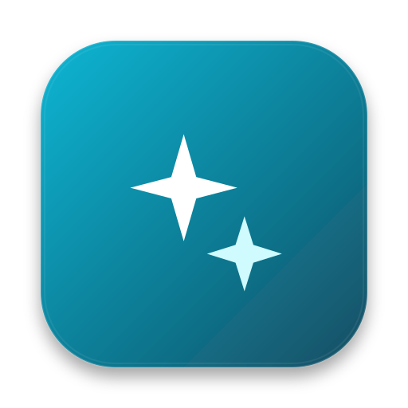
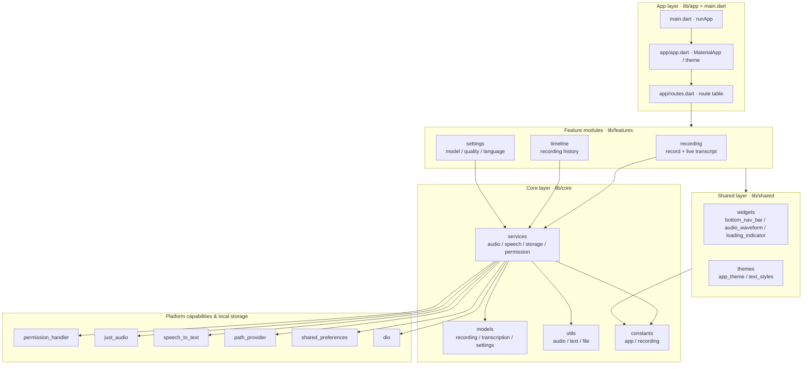
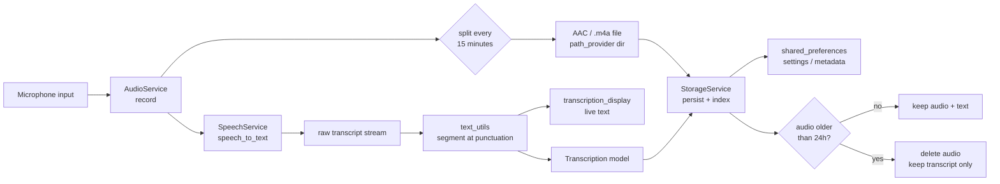
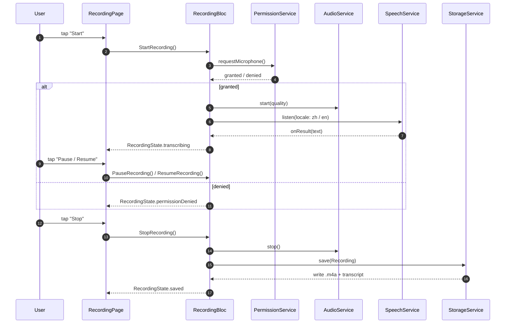
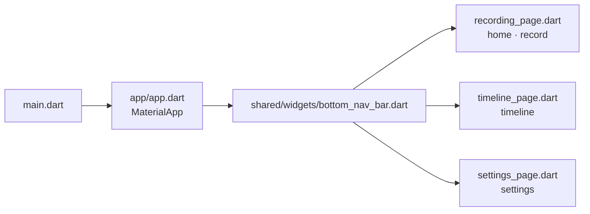
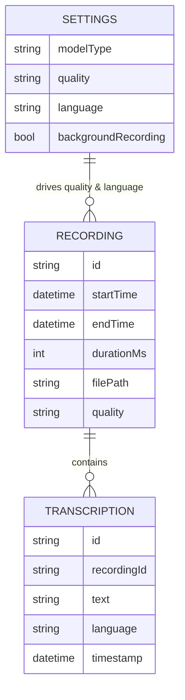

<div align="center">

> **English** | [简体中文](./README.md)



# assistantx — Always-on recording · Live transcription · ADHD-friendly

**Never lose a conversation again — open and record, speak and get text, review it on a timeline.**


</div>

---

## ⚠️ Project status (read this first)

This repository is currently at the **"design-first · scaffold"** stage. Please read it with the right expectations:

- ✅ **In place**: the complete product design and phased development specs under `RaySpec/`; a modular directory structure (generated by `create_project_structure.sh`); dependencies configured and locked in `pubspec.yaml` / `pubspec.lock`.
- 🚧 **Not implemented yet**: **every `.dart` file under `lib/` other than `main.dart` (the default Flutter counter demo) is currently an empty placeholder**. Recording, transcription, timeline and settings logic are **all unwritten**.
- 📐 The architecture and flow diagrams below describe the **target architecture defined in `RaySpec/Building/Project.md`** — they align future development and **do not represent shipped features**.

> This is not a "runs and records audio" product. It is an **engineering skeleton + design constraints** designed to be handed directly to an AI agent for continued execution. Every "how A works" statement below is **planned / by design**.

---

## Why it exists

For **people with ADHD**, **business professionals** and **students**, the real pain is not "no voice recorder":

- 🧠 **Forget the moment you look away**: key details from meetings / lectures / negotiations scatter across memory and fragmented notes, with no way to reconstruct them.
- 📱 **Recording ≠ searchable**: hours of audio with no readable, searchable, copyable text is effectively the same as no recording at all.
- 🔋 **Operational overhead**: generic recorders need many taps, and you must remember to start — and stop. That is exactly the step ADHD users most easily miss.

**assistantx aims to make it "zero-effort"**: open the app straight into the recording screen, get live text while you speak, and have each session drop into a time-ordered timeline — with a storage policy of "**keep audio for 24 hours, keep text forever**". Leave the forgetting to the machine; you just talk.

> **Built for the future**: recording is only the foundation. `RaySpec` already plans AI capabilities such as auto-segmentation, live translation, Q&A over recordings, automatic memory, and to-do / scheduling (see "Features" below).

---

## ✨ Features

> Legend: ✅ In place (structure / dependencies / spec) · 🚧 Planned (designed, code pending)

### Recording

- 🚧 **Record on open**: the app launches straight into the recording screen, no navigation needed.
- 🚧 **Pause / resume**: switch recording state via a floating button.
- 🚧 **Two quality tiers**: standard `16 kHz / 64 kbps`, high `44.1 kHz / 128 kbps`.
- 🚧 **Long sessions**: split into new files every **15 minutes**, up to **12 hours** per session.
- 🚧 **Background recording**: keep recording when the app goes to the background (needs background permission).

### Live transcription

- 🚧 **Real-time text**: display transcription while recording; target latency **< 3 s**.
- 🚧 **Chinese + English**: both supported as primary languages.
- 🚧 **Smart segmentation**: auto line-break at **sentence punctuation** to turn a speech stream into readable paragraphs.
- 🚧 **Local model / online API**: selectable transcription backend (online services such as iFlytek are a later plan).

### Timeline

- 🚧 **Left-side timeline**: list every recording with start time, duration and end time.
- 🚧 **Play / delete / search**: replay audio, delete records, search the transcript text.

### Storage & privacy

- 🚧 **AAC (`.m4a`)** files on disk.
- 🚧 **24-hour capacity policy**: keep roughly 24 hours of audio; beyond that, auto-delete audio and **keep only transcript text**.
- 🚧 **Local-first + encryption**: encrypted, privacy-first storage (an explicit requirement).

### Engineering skeleton

- ✅ **Modular layout**: five layers — `core / features / shared / app / localization`.
- ✅ **State management chosen**: `flutter_bloc 9.1.1` + `bloc 9.1.0`.
- ✅ **Multi-platform**: Android / iOS / macOS / Windows / Linux / Web scaffolds all generated.
- ✅ **Spec-doc system**: `RaySpec/` holds requirements, architecture conventions, phased prompts, a checklist and a change history.

---

## 🚀 Quick Start

### Option 1 — For AI agents (one-shot, recommended)

Paste the prompt below to your local AI agent (Claude Code / Codex / OpenCode …):

````markdown
Please set up assistantx (GitHub: https://github.com/RayMorTwinkle/assistantx).
Context: this is a Flutter/Dart "always-on recording + live transcription" app aimed at
people with ADHD. It is currently at the scaffold stage — directories and dependencies are
ready, but most code under lib/ is still empty placeholders.
Read RaySpec/Building/Project.md first to learn the layout conventions and coding rules.

Steps:
1. Clone and enter: git clone https://github.com/RayMorTwinkle/assistantx.git && cd assistantx
2. Confirm Flutter >= 3.35.0 and Dart >= 3.9.2 (flutter --version).
3. Fetch dependencies: flutter pub get
4. Static analysis: flutter analyze (should pass with no fatal errors).
5. Run the default entry: flutter run (you will currently see the default counter demo).
6. Report: what is already in place, any environment mismatches, and which module to build next per Project.md.
````

### Option 2 — For humans

```bash
git clone https://github.com/RayMorTwinkle/assistantx.git
cd assistantx
flutter pub get        # resolve the versions locked in pubspec.lock
flutter analyze        # static analysis
flutter run            # run (currently the default demo screen)
```

> **Requirements**: Flutter `>=3.35.0` (stable), Dart SDK `^3.9.2`.
> Android builds need the Android SDK; desktop builds (macOS / Windows / Linux) need the matching toolchain.
> Before writing code, read `RaySpec/Building/Project.md` — it is this project's highest authority.

---

## 🖥️ Usage

### Target workflow (planned)

```text
Launch ──▶ Recording page (home)          Timeline page            Settings page
──────      ─────────────────────         ───────────────          ─────────────
straight      live transcript scrolls      recordings in a           transcription model
to record     "🎙️ start"                   time-ordered list         recording quality
              "⏸️ pause / ▶️ resume"        tap to replay /           language (zh / en)
              "⏹️ stop" → saved            delete / search           24h capacity policy
              to the timeline
```

### The three pages

| Page | Source file | Responsibility (planned) |
|---|---|---|
| Home · Recording | `lib/features/recording/pages/recording_page.dart` | Record on open; show live transcript; start/pause/resume |
| Timeline | `lib/features/timeline/pages/timeline_page.dart` | Time-ordered recording history; play / delete / search |
| Settings | `lib/features/settings/pages/settings_page.dart` | Model, recording quality and language, persisted |

---

## 🏗️ Architecture

> Target architecture defined in `RaySpec/Building/Project.md` (real module names and dependencies come from that document). Business code is not implemented yet.

### System overview

Five layers: the app layer wires together feature modules and shared widgets; feature modules depend on core services, models, utils and constants; services talk to platform capability plugins.



### Data flow: record → transcribe → store

Audio fans out into two paths: one through `SpeechService` producing live text, one written to disk as `.m4a`. Text is segmented at sentence punctuation, feeding both the live UI and persistence. Storage trims audio by the 24-hour policy.



### Key flow: recording state machine (Bloc)

`RecordingPage` only renders and dispatches events; `RecordingBloc` orchestrates the four services (permission, audio, speech, storage).



### Navigation

The bottom navigation bar is the single switch point between the app layer and the three feature pages.



### Data model

Three core models: `Recording` (one recording), `Transcription` (its text), `Settings` (quality and language).



> Field names are derived from the model responsibilities described in `Project.md`; **the final fields are defined by the eventual `lib/core/models/*.dart`**.

---

## 📂 Project layout

```text
assistantx/
├── lib/
│   ├── main.dart                     # app entry (currently the default counter demo)
│   ├── app/                          # app layer: app.dart (config/theme), routes.dart (routes)
│   ├── core/                         # core layer
│   │   ├── constants/                # app_constants.dart, recording_constants.dart
│   │   ├── utils/                    # audio_utils.dart, text_utils.dart, file_utils.dart
│   │   ├── services/                 # audio / speech / storage / permission services
│   │   └── models/                   # recording / transcription / settings models
│   ├── features/                     # feature modules
│   │   ├── recording/                # pages / widgets / bloc
│   │   ├── timeline/                 # pages / widgets / bloc
│   │   └── settings/                 # pages / widgets / bloc
│   ├── shared/                       # shared layer: widgets (incl. audio_waveform), themes
│   └── localization/                 # arb/app_en.arb, arb/app_zh.arb, localization.dart
├── RaySpec/                          # project spec system (the "highest authority")
│   ├── Create/Beginning.md           # requirements & design Q&A (audience / pages / specs)
│   ├── Building/Project.md           # layout + coding rules + coupling points + change log
│   ├── Building/Check.md             # checklist (flutter analyze / update Project.md)
│   ├── ORtoken.md                    # 4-phase, 12-step development prompts
│   └── Fix/History.md                # archived change records past the 7-day window
├── android/  ios/  macos/  windows/  linux/  web/   # six-platform host scaffolds
├── assets/
│   ├── logo.svg                      # project icon used by this README
│   └── icons/                        # icon asset dir (declared in pubspec.yaml)
├── create_project_structure.sh       # generates the lib/ tree (touch placeholders)
├── pubspec.yaml                      # dependencies & assets
├── pubspec.lock                      # locked versions (Dart ^3.9.2 / Flutter >=3.35.0)
└── analysis_options.yaml             # flutter_lints static analysis rules
```

---

## 🔧 Technical notes

**Core dependencies (versions from `pubspec.lock`, locked)**

| Package | Version | Purpose |
|---|---|---|
| `flutter_bloc` / `bloc` | `9.1.1` / `9.1.0` | State management and event orchestration |
| `speech_to_text` | `7.3.0` | Speech-to-text (live transcription) |
| `just_audio` | `0.10.5` | Audio playback |
| `permission_handler` | `12.0.1` | Microphone / storage / background permissions |
| `path_provider` | `2.1.5` | Locate the local storage directory for recordings |
| `shared_preferences` | `2.5.3` | Persist settings and metadata |
| `dio` | `5.9.0` | HTTP requests (online transcription API, etc.) |
| `cupertino_icons` | `1.0.8` | iOS-style icons |

**Environment & platform**

- Dart SDK constraint `^3.9.2`; Flutter engine constraint `>=3.35.0` (`.metadata` channel: `stable`).
- Android `applicationId` / `namespace` is `com.example.assistantx` (still the default, not replaced).
- `lib/localization/` reserves i18n (`app_en.arb` / `app_zh.arb`), but `pubspec.yaml` has no `flutter_localizations` / `intl` generation entry yet (**to be confirmed**).

**Hard numbers from the product spec (source: `RaySpec/Create/Beginning.md`)**

| Item | Value |
|---|---|
| Standard quality | `16 kHz` sample rate, `64 kbps` bitrate |
| High quality | `44.1 kHz` sample rate, `128 kbps` bitrate |
| Split / max length | split every `15 minutes`, up to `12 hours` per session |
| Audio format | AAC (`.m4a`) |
| Audio capacity policy | keep ~`24 hours` total, then delete audio and keep text |
| Transcription languages | Chinese, English |
| Transcription latency target | `< 3 s` |
| Responsive breakpoint | single breakpoint at `800 px` (mobile / desktop) |

**Coding rules (source: `RaySpec/Building/Project.md` — read before contributing)**

- Naming: files `snake_case`, classes `PascalCase`, vars/functions `camelCase`, constants `UPPER_SNAKE_CASE`, private `_x`.
- Keep files ideally `≤ 300` lines (split threshold `400`); prefer `const` constructors; import order Dart → third-party → project.
- Run `flutter analyze` after every change; update file headers and sync `Project.md`.

**Module coupling points (change one, check the rest)**

1. Recording module ↔ storage service: changing the audio format requires checking file handling.
2. Transcription service ↔ settings module: changing model selection requires verifying service compatibility.
3. Timeline module ↔ recording model: changing the data structure requires updating timeline rendering.
4. Permission service ↔ all feature modules: permission logic changes affect every permission-dependent feature.
5. Theme system ↔ all UI widgets: theme changes require checking every custom widget.

---

## ❓ FAQ

**Q: If I clone it now, can it record?**
A: No. It is at the scaffold stage; business code under `lib/` is empty placeholders, and `flutter run` shows the default Flutter counter demo. Start from `RaySpec/Building/Project.md` and the phased prompts in `RaySpec/ORtoken.md`.

**Q: Why so many documents under `RaySpec/`?**
A: This project is "design-first". `Create/Beginning.md` defines requirements, `Building/Project.md` sets layout and rules (highest authority), `ORtoken.md` gives 4-phase / 12-step executable prompts, and `Check.md` is the checklist. Every change must stay consistent with these docs.

**Q: Does transcription use a local model or an online API?**
A: Both are selectable by design (switchable in Settings). Online services (e.g. iFlytek) are a later plan; the concrete implementation is **to be confirmed**.

**Q: Is `assistantx` a C++ project?**
A: No. It is a **Flutter / Dart** app. `android/ ios/ macos/ windows/ linux/ web/` are Flutter's multi-platform host directories, which does not mean business logic is written in each platform's native language.

**Q: Which platforms can it run on?**
A: All six scaffolds are generated (Android is the priority, then Web / macOS / Windows, etc.). Feature completeness per platform varies as implementation progresses.

---

## ⚠️ Notes

- There is **no recording / transcription implementation** yet — do not judge finished capabilities from this repo.
- Audio is private: the design emphasizes **local storage + encryption**, but **encryption is not implemented** (to be confirmed).
- Permission-denied policy: mic or storage denied → exit with a prompt; background denied → main features still work, but no background recording.
- `com.example.assistantx` is the default Flutter package name and **must be replaced before distribution**.
- Background recording and continuous transcription are **battery-heavy**; handle battery optimization when implementing.

---

## 📄 License

This repository currently **ships no open-source license file**. Until one is added, all rights are reserved by default. For distribution, adding a license (e.g. MIT) is recommended.

---

## 🙏 Credits

- Requirements, layout and coding rules come from this repo's `RaySpec/` docs (`Create/Beginning.md`, `Building/Project.md`, `ORtoken.md`, `Check.md`).
- The icon, this README (bilingual) and all architecture diagrams were produced for this project.
- The scaffold is initialized from the official [Flutter](https://flutter.dev/) template; core capabilities come from open-source packages such as `speech_to_text`, `just_audio`, `flutter_bloc` and `permission_handler`.

---

<div align="center">
<sub>assistantx · Leave the forgetting to the machine — you just talk</sub>
</div>
